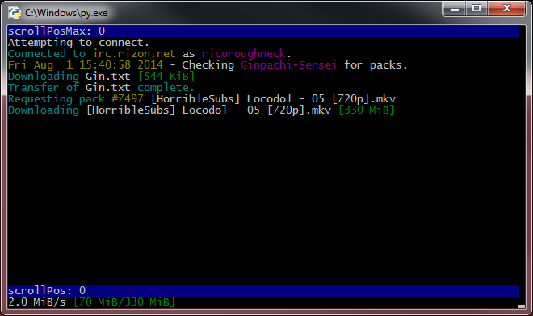

# irc

Lightweight irc client for xdcc (and maybe more!)

## running the code

Open main.py or main-gui.py for example usages.

## user interface

In order to use the text-based user interface the curses module must be installed.

UNIX-based python versions should have this by default.

Windows users can download curses [here](http://www.lfd.uci.edu/~gohlke/pythonlibs/#curses).

**Note:** Make sure to download for the correct python version and system architecture.
